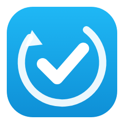
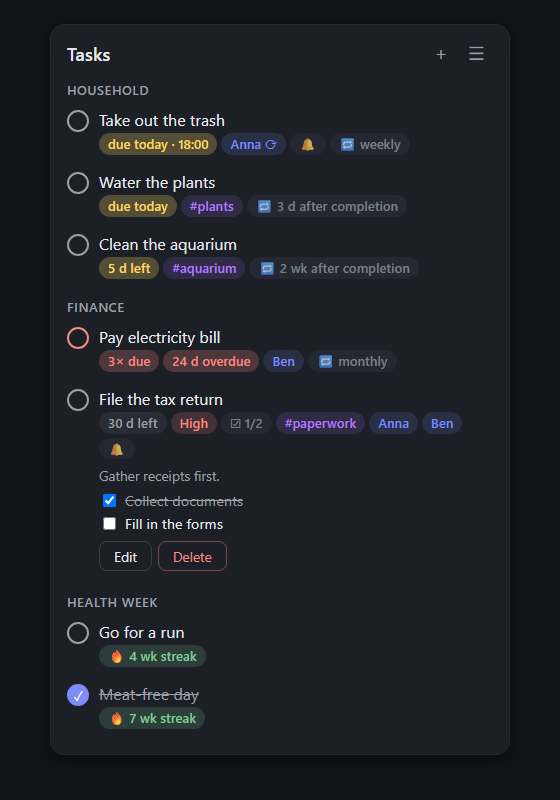
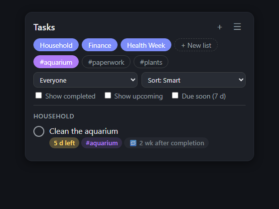
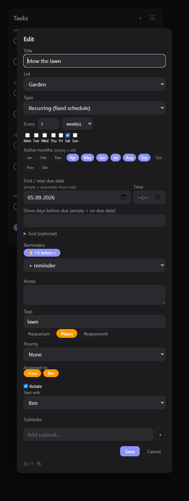

<p align="center">
  
</p>

# Better ToDo

[](https://github.com/Timmes123/ha-better-todo/releases)
[](https://github.com/Timmes123/ha-better-todo/actions/workflows/validate.yml)
[](LICENSE)

A feature-rich task manager for Home Assistant with a custom dashboard card — built for
**recurring tasks that actually work the way you need them to**.

<p align="center">
  
</p>

## Why another todo integration?

Most todo apps (including the built-in HA todo lists) only support one kind of recurrence:
a fixed schedule. Real life needs more:

| Use case | What Better ToDo does |
|---|---|
| 💸 *"Pay the bill — due on the 1st of every month."* You pay it on the 10th. | The next occurrence is still the **1st of the next month** (schedule-based recurrence). Missed months don't pile up as duplicates — you get a single task with a **"3× due" counter** and can complete one occurrence or all at once. |
| 🚽 *"Deep-clean the bathroom — once a month."* You do it 3 weeks late. | The next occurrence is **one month after you actually did it** (after-completion recurrence) — no nagging about a stale schedule. |
| 📄 *"Cancel the contract before Dec 31."* | The task stays invisible until Dec 1 (**visible-from date**), then shows a **live countdown** to the deadline. |
| 🚴 *"Ride the bike once a week."* | A **weekly task** that reopens every Monday, tracks your **streak** ("15 wk streak 🔥") and how long you've been skipping it ("3 wk missed"). Skipping deliberately **freezes** the streak instead of breaking it. |
| 🗑️ *"Kids take turns carrying out the trash."* | **Rotating assignment** over a freely chosen pool of persons — every completion passes the task to the next person. |

## Features

- **Four task types**: one-time (with optional visible-from + deadline countdown),
  recurring on a fixed schedule, recurring after completion, and weekly/monthly
  habit-style tasks with streaks.
- **Cron-style schedules**: every N days/weeks/months/years, multiple weekdays per week,
  a fixed day of month (1–31), the *last* day of the month, the *nth* or *last* weekday
  ("2nd Saturday", "last Wednesday"), yearly on a fixed date — plus an optional end date
  or maximum number of repetitions.
- **Due times & reminders**: up to 5 reminders per task, fired as Home Assistant events —
  hook up an automation for push notifications (example below).
- **Multiple lists**, **tags** with filter chips, subtasks, optional priorities.
- **Assignment & rotation** over Home Assistant `person` entities; a "logged-in user"
  filter gives every family member their own view without per-user dashboards.
- **Standard `todo` entity and `calendar` entity per list** — your tasks show up in the
  Companion App, on watches, in voice assistants and in the HA calendar (recurring tasks
  are expanded onto every occurrence). Better ToDo's own storage stays the single source
  of truth.
- **Services and events** for automations, plus a completion history from day one.
- **Feature toggles**: switch off everything you don't need (priorities, subtasks,
  assignment, rotation, habit tasks, tags, mirror/calendar entities) — from "dumb list"
  to full feature set.
- **Custom dashboard card** shipped with the integration (auto-registered, no extra
  install): filters, sorting, drag & drop, in-card menu, visual config editor, 7 languages
  (EN/DE/FR/ES/IT/NL/PL), fully theme-aware.

## Installation

### HACS (recommended)

[](https://my.home-assistant.io/redirect/hacs_repository/?owner=Timmes123&repository=ha-better-todo&category=integration)

1. Click the button above (or: HACS → ⋮ → *Custom repositories* → add
   `Timmes123/ha-better-todo` with category *Integration*).
2. Download **Better ToDo** and restart Home Assistant.
3. Add the integration:

   [](https://my.home-assistant.io/redirect/config_flow_start/?domain=better_todo)

   (or *Settings → Devices & Services → Add Integration → Better ToDo*)

The dashboard card is registered automatically — after an update, hard-refresh your
browser (Ctrl+F5) once so it picks up the new version.

### Manual

Copy `custom_components/better_todo/` into your `config/custom_components/` folder and
restart. HACS is strongly recommended so you get updates.

## The card

| Filters & sorting | New-task dialog |
|:---:|:---:|
|  |  |

Minimal configuration:

```yaml
type: custom:better-todo-card
```

A personal "my tasks" card for a wall tablet:

```yaml
type: custom:better-todo-card
title: My tasks
assigned: me            # tasks assigned to the logged-in user
show_menu: false
show_add: false
sort: due
```

One card per list, side by side (kanban style):

```yaml
type: grid
columns: 2
square: false
cards:
  - type: custom:better-todo-card
    lists: [Household]
    sort: manual        # enables drag & drop reordering
  - type: custom:better-todo-card
    lists: [Healthy Week]
```

There is also a **visual editor** — just add the card from the dashboard card picker and
configure it without YAML.

### All card options

| Option | Default | Description |
|---|---|---|
| `title` | – | Card title |
| `lists` | all | List names or ids to show |
| `assigned` | `all` | `all`, `me` (logged-in user) or a `person.*` entity id |
| `sort` | `smart` | `smart`, `manual` (drag & drop), `due`, `priority`, `title`, `person` |
| `show_menu` | `true` | In-card filter menu (lists, tags, person, sort, toggles) |
| `show_add` | `true` | "+" button to add tasks/lists |
| `show_completed` | `false` | Show completed tasks |
| `show_upcoming` | `false` | Show upcoming/hidden tasks |
| `due_soon_days` | `7` | Window for the "due soon" filter |
| `compact` | `false` | Denser rows |
| `max_height` | – | Max card height in px (scrolls inside) |
| `confirm_complete` | `false` | Ask before completing a task |

## Automations

### Services

```yaml
# Create a task when the washing machine finishes
service: better_todo.add_task
data:
  list: Household           # created automatically if it doesn't exist
  title: Hang up the laundry
  assigned_to: person.alex
```

```yaml
# A recurring task, fully scripted
service: better_todo.add_task
data:
  list: Finance
  title: Pay rent
  type: scheduled
  due_date: "2026-09-01"
  schedule: { freq: monthly, interval: 1, day: 1 }
```

Also available: `better_todo.complete_task`, `better_todo.skip_task`,
`better_todo.remove_task` (by `task_id` or exact `title`).

### Events

| Event | Fired when |
|---|---|
| `better_todo_item_created` | a task is created |
| `better_todo_item_completed` | a task is completed |
| `better_todo_item_due` | a task becomes due (daily at midnight) |
| `better_todo_item_overdue` | a task is overdue (daily at midnight) |
| `better_todo_item_reminder` | a reminder fires (event data includes `offset_minutes`) |

### Push notifications for reminders

```yaml
alias: ToDo reminders to my phone
triggers:
  - trigger: event
    event_type: better_todo_item_reminder
actions:
  - action: notify.mobile_app_your_phone
    data:
      title: "📝 {{ trigger.event.data.title }}"
      message: >-
        Due {{ trigger.event.data.due }}
        at {{ trigger.event.data.due_time }}
```

## Data & backups

All data lives in Home Assistant's storage (`.storage/better_todo`) and is included in
normal HA backups. The `todo`/`calendar` entities are read-write mirrors — deleting them
(or toggling them off in the integration options) never touches your task data.

## Roadmap

- Per-list sensors (open/due/overdue per list & person) and statistics
- Sections inside lists, kanban view
- Actionable notification helpers
- Optional AI integration via HA `ai_task` entities
- External platform sync (CalDAV/Todoist/Google Tasks) — deliberately last

## License

[MIT](LICENSE)
